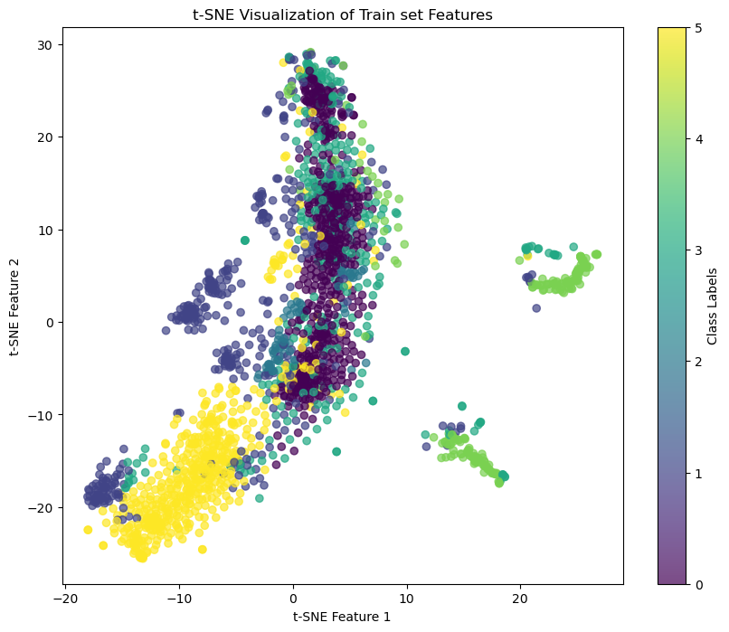
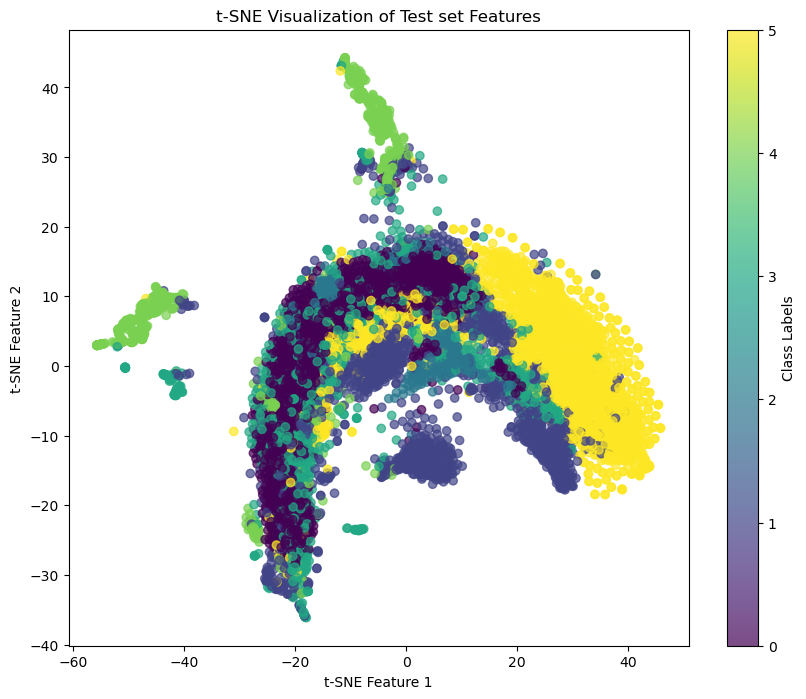

## 資料集簡介

本議題所提供之影像資料，包含 6 個類別（正常類別 + 5 種瑕疵類別）。
下載資料 aoi_data.zip 檔案包含：

- train_images.zip：訓練所需的影像資料（PNG格式），共計 2,528 張。
- train.csv：包含 2 個欄位，ID 和 Label。
  - ID：影像的檔名。
  - Label：瑕疵分類類別
    （0 表示 normal，1 表示 void，2 表示 horizontal defect，3 表示 vertical defect，4 表示 edge defect，5 表示 particle）。
- test_images.zip：測試所需的影像資料（PNG格式），共計 10,142 張。
- test.csv：包含 2 個欄位，ID 和 Label。
  - ID：影像的檔名。
  - Label：瑕疵分類類別（其值只能是下列其中之一：0、1、2、3、4、5）。

## 筆記

- VGG16最初 batch_size 取 32 ，勉強能跑，但太慢了。~40min/epoch
  所以改到 batch_size=8。~30 sec/epoch

- VGG16使用crossEntropyLoss，Loss_val 只能收斂到~1.6

  改至resnet18 - crossEntropyLoss，Loss_val 能收斂至<0.2

- 我取的val set是由所有training set 中分離出20%抽取而成。

  神奇的是訓練到剛開始收斂時，Loss_val 會先低於 Loss_train。

## Train

- 1

  `resnet18, batch_size=8, lr=0.001`

- 2

  `resnet18, batch_size=8, lr=0.001`

  最佳val_loss=0.10，使用該模型的test_accuracy=0.973

- 3

  `resnet18, batch_size=16, lr=0.0005`

  最佳val_loss=0.07，使用該模型的test_accuracy=0.983

  
  
  

## Test Result

## t-SNE 

左側是train set在模型最後一層隱藏層的輸出作為特徵，以t-SNE降維，預測標籤著色的圖。
右側是test set以相同方法產生的降維圖。

第0、第5類在圖中較聚集，其餘則分散為多個群聚。

第4類有2個明顯與其他樣本點脫離的群聚。由於第4類表示edge defect，這也可能表示可以額外細分出另外的子分類。