## 資料集簡介

```
>DRIVE
├─test	//不使用
│  ├─images
│  └─mask
└─training	//本次作業只使用這個
    ├─1st_manual
    ├─images
    └─mask	//不使用
    
>DIRVE_TESTINGSET
```

- training 訓練集
  - images : 原圖
    - 檔名格式: `21_training.tif` ，序號 21~40，共 20張訓練資料
    - RGB，565*584
  - 1st_manual : 手動標記血管的二元影像
    - 檔名格式: `21_manual1.gif` ，序號 21~40，共 20張訓練資料
      手動標記的
    - Gray，565*584
  - mask : 標示眼球位置的二元影像
    - 考慮到老師給的`DIRVE_TESTINGSET`中沒有附帶mask，故直接拿`images `中的圖像進模型訓練
- test 測試集
  - DIRVE_TESTINGSET : 
    - 原圖
      - 檔名格式: `01_real_A.png` ，序號 01 ~19，共 19張測試資料
      - RGB，512*512
    - 手動標記血管的二元影像
      - 檔名格式: `01_real_B.png` ，序號 01 ~19，共 19張測試資料
      - RGB，512*512


注意train與test的影像大小不一樣!


## Train

- loss: BCELoss()
- learning rate: 0.001
- epochs: 100

最佳 loss = 0.0811

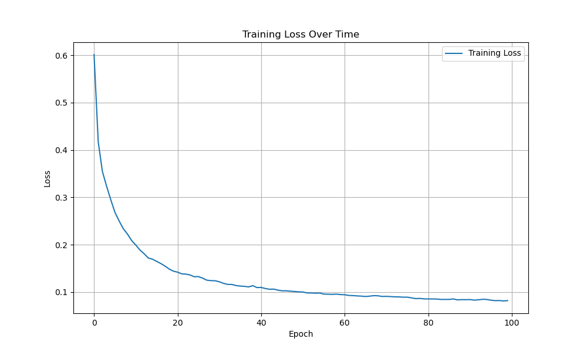

## Evaluation

### 每一張測試集圖像的比較

由左至右分別是: `原圖`, `模型預測`, `ground truth`

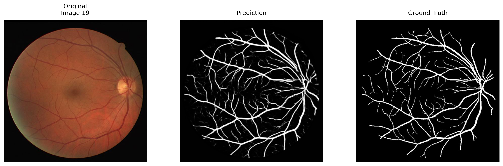

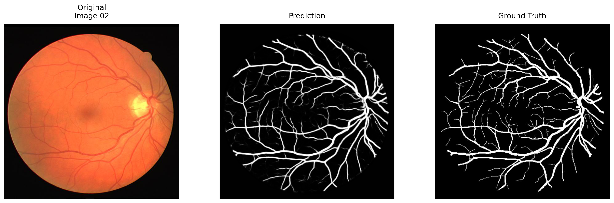

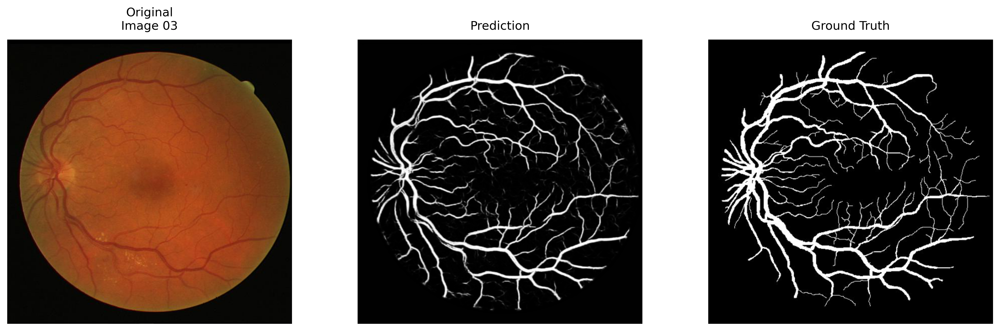

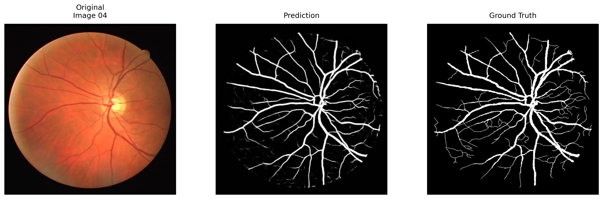

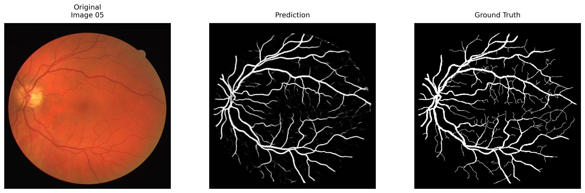

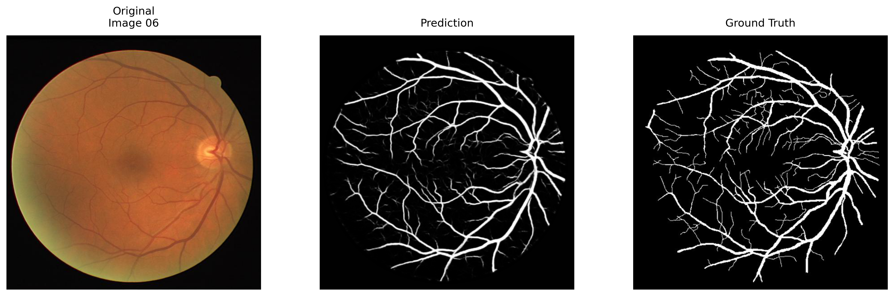

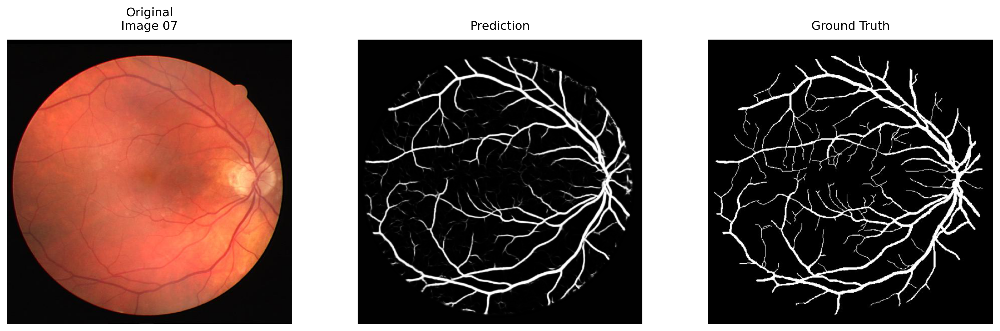

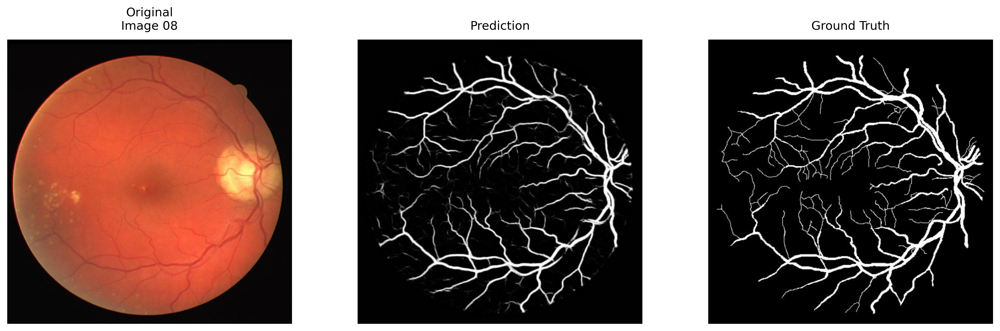

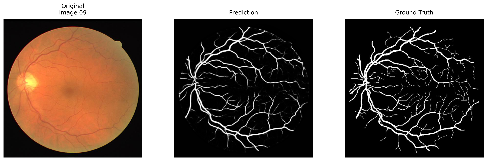

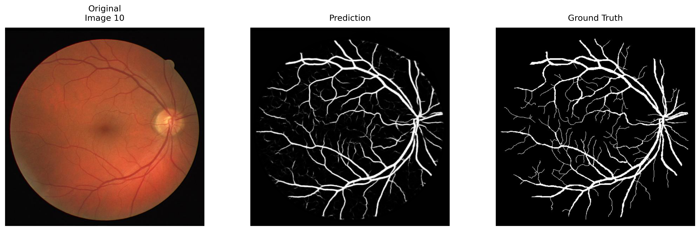

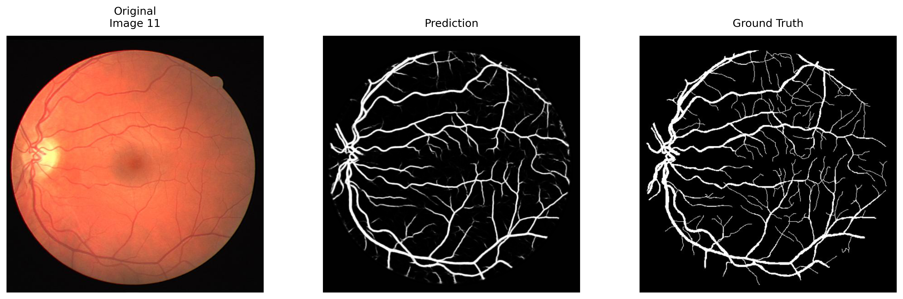

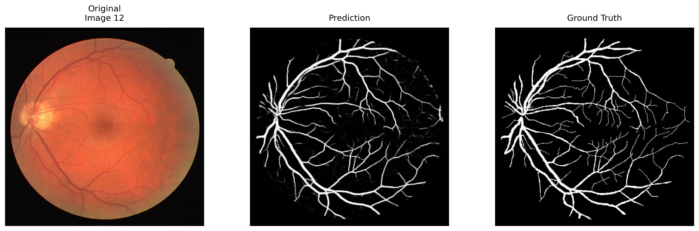


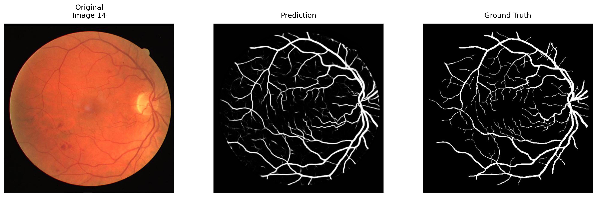

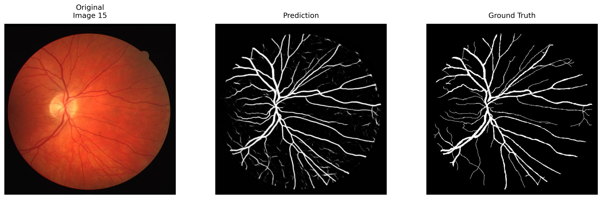

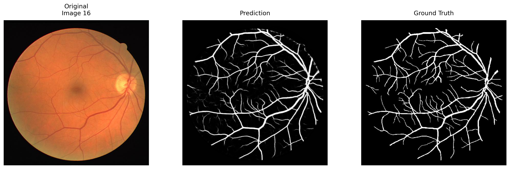

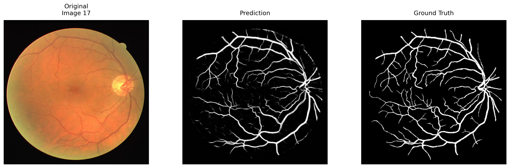

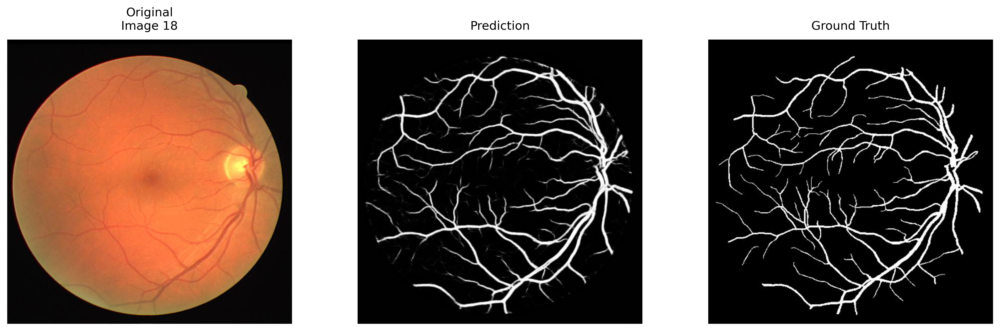


### 指標: IOU, F1

| Image    | IoU      | F1       |
| -------- | -------- | -------- |
| Image_01 | 0.668726 | 0.801481 |
| Image_02 | 0.707754 | 0.828871 |
| Image_03 | 0.585108 | 0.738256 |
| Image_04 | 0.674457 | 0.805583 |
| Image_05 | 0.639795 | 0.780336 |
| Image_06 | 0.627565 | 0.77117  |
| Image_07 | 0.641031 | 0.781254 |
| Image_08 | 0.611096 | 0.758609 |
| Image_09 | 0.605927 | 0.754613 |
| Image_10 | 0.645838 | 0.784814 |
| Image_11 | 0.641263 | 0.781426 |
| Image_12 | 0.655914 | 0.792207 |
| Image_13 | 0.652899 | 0.790005 |
| Image_14 | 0.666862 | 0.80014  |
| Image_15 | 0.651382 | 0.788893 |
| Image_16 | 0.68536  | 0.81331  |
| Image_17 | 0.621204 | 0.766349 |
| Image_18 | 0.670443 | 0.802713 |
| Image_19 | 0.706089 | 0.827729 |
| Average  | 0.650459 | 0.787777 |